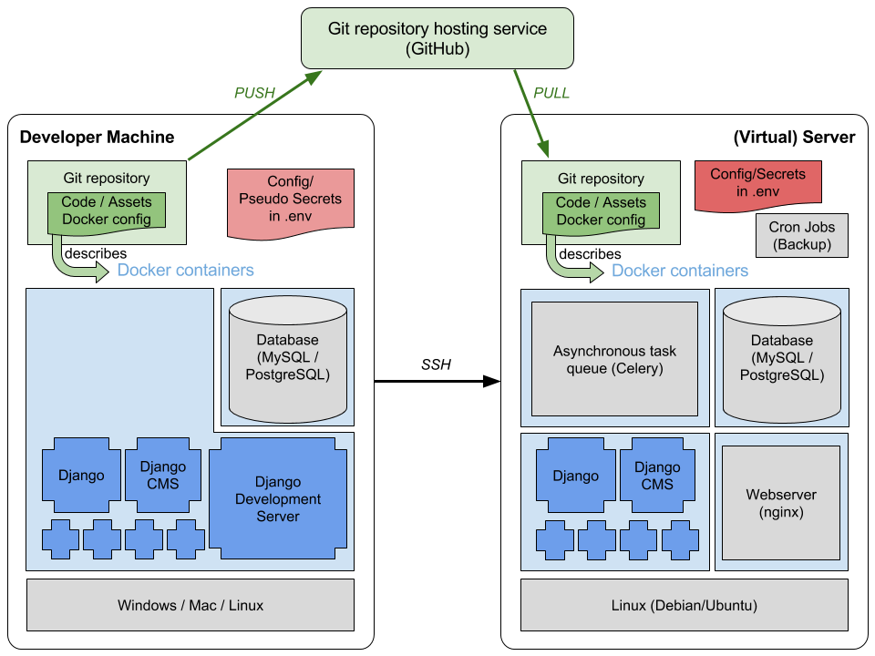

# Server setup, configuration and maintenance

This file contains setup with docker. Many of the steps you may expect to setup a webstack are automatized. You can still look them up in the [Dockerfile](../../configurations/dockerfile-new).

The setup instructions are divided into:

* common steps for all setups

* steps for local development

* steps only necessary on the production server

The following picture sketches the setup. Some notes:

* Deployment is done by logging in to the server via SSH and pulling the (production-)branch from the repository

* The python environment is configured the same locally and on the server.

* On the server a faster and more secure web server (nginx) is used instead of the Django development server

* Some secrets (config file with login information, secret keys) are not synchronized via the repository. This secrets also differ from the one used on development machines.



## Setup basic tools

You must use [git](https://git-scm.com/) for code management and [Docker](https://www.docker.com/) for setup automation.

We use a standard `Debian 8` on the server. On development machines, any operating system can be used in principle (we know that many Linux und Mac OS versions works). The instructions here are compiled for a **Debian/Ubuntu** installation.

First update your system:

```shell
sudo apt-get update
sudo apt-get upgrade
```

*NOTE*: Package names can deviate depending on your Linux distribution.

```shell
sudo apt-get install git mysql-client
```

We need [Docker Community Edition (CE)](https://docs.docker.com/engine/installation/linux/ubuntu/) and [docker-compose](https://docs.docker.com/compose/install/). With prerequisites satisfied, it boils down to

```shell
sudo apt-get install docker-ce
sudo curl -L "https://github.com/docker/compose/releases/download/1.11.2/docker-compose-$(uname -s)-$(uname -m)" -o /usr/local/bin/docker-compose
sudo chmod +x /usr/local/bin/docker-compose
```

Start the docker daemon:

```shell
sudo service docker start
```

### Setup basic tools with Fedora
The above instructions are basically the same with Fedora, except that you have have to use dnf instead of apt. Altogether, the following instructions install everything one needs:
```shell
sudo dnf update
sudo dnf install git mysql docker docker-compose
```

### IDE

Install a local IDE. We highly recommend to use [PyCharm](https://www.jetbrains.com/pycharm/). The full version has Django support and is free for educational purposes.

To get the educational version, go to [PyCharm Student](https://www.jetbrains.com/shop/eform/students) and fill out the form using an official @ethz.ch mail address. After completing, you will receive an e-mail from JetBrains with a link to confirm your request. If all works well, you will receive another e-mail with further instructions on how to set up a JetBrains user account.

Finally you can download PyCharm Professional Edition, extract it and place it somewhere you want. There is no installation required. To start the program run `<YourPyCharmFolder>/bin/pycharm.sh`.

Activation is easiest if you download the licence-file from your JetBrains account-page. When asked for activation, simply drag&drop the file into the activation-key textbox.


## Setup local project folder

### Pull files with git

Create a folder on your machine where you want to store the local copy of the repository. This could e.g. be in your home directory.

```shell
mkdir ~/Projects/<project home>
```

Now cd into the newly created folder

```shell
cd ~/Projects/<project home>
```

and execute the following commands to tell git that your local copy of the repository now lives in this folder.

```shell
git init
git remote add origin https://github.com/gitsimon/tq_website.git
git fetch
git checkout -t origin/master
```

If you want to work on your own branch, create it and check it out

```shell
git branch dev-<your name>
git checkout dev-<your name>
```

You can push it to the server and setup push/pull by

```shell
git push -u origin <branch>
```

It's a good idea to rebase your branch on the master from time to time. While your branch is checked out, run:

```shell
git rebase master
```

Git is a powerful tool. Have a look at the [official documentation](//git-scm.com/doc), especially on [branching](https://git-scm.com/book/it/v2/Git-Branching-Remote-Branches).

### Make helper scripts executable

Since file permissions are not synchronized with git, you have to make the helper scripts executable:

```shell
sudo chmod +x scripts/*
```


### Initial Configuration

We have to create 2 files, that are not under version control, manually:

Create the maintenance file `<project home>/maintenance.conf`. You can use the provided template file and copy it with

```shell
cp configurations/maintenance-template.conf maintenance.conf
```

(Whenever doing maintenance on a live server, switch the flag in this file to 1 (and back again), and restart docker-compose to make nginx reload the config and display a maintenance message)

Create the *secret* environment file `<project home>/.env`. You can use the provided template file and copy it with

```shell
cp configurations/.env-template .env
```

This files are not under version control because it contains some secrets and machine dependent configurations and secrets.

*Attention*: The configured mail account is used to - depending on the action - send huge amounts of auto-generated mails. Leave the mail settings empty (as it is in the template) or configure a test mail server before starting a production-like docker configuration (which will actually send out mails!).


## Let docker install all development dependencies

*Note:* In the current setup the `docker-compose.yml` is customized via environment variables. Due to escaping issues, this works only with the zsh shell which may not be standard on some unix based systems.

**On development machine**:

Run in the `<project home>` directory:
```shell
docker-compose build
```
It will fetch all required dependencies and install it for you.


*Note*: This can take some minutes

*Note*: If you encounter a problem because some ports are already in use, you can choose your preferred development ports in the `.env`-file.

**In production environment** (or to setup a production-like stack on development machine):

```shell
docker-compose -f docker-compose-production.yml build
```

**Simulated production environment** (to setup a production-like stack on development machine):

```shell
docker-compose -f docker-compose-production-no_ssl.yml build
```


## Load test data into database

Get in touch with admin to get a backup of live database (with removed personal data).
The backup can then be applied to the database with (while docker is running the containers)

```shell
mysql -h 127.0.0.1 --port=3309 -u root -proot -t tq_website < database_dump.sql
```

    
## Create super user

Create a superuser with your favorite name and password:

```shell
./scripts/create_superuser.sh
```

*Note*: This are the credentials to login anywhere on the frontend/backend.

*Note*: Even if the loaded database dump contains a user representing you you have to repeat that step since the dump has different salted passwords, so your password will be considered invalid.

## Test the website locally

Whenever working on the project, run the following command in the `<project home>` directory primarily:
```shell
docker-compose up --build
```

While this command is running you should be able to view the local, full-stack website at this addresses:

* `localhost:8000` or `127.0.0.1:8000`

* `localhost:8001` or `127.0.0.1:8001` (if you started with `-f docker-compose-production-no_ssl.yml`)

# Apply code changes

*Note*: This method of applying code changes does not destroy your test data, but gradually migrates the database.

Pull the changes from the correct branch (here the master):

```shell
git pull
```

If you are working on your own developper branch, pull the changes of the master branch explicitely:

```shell
git pull origin master
```

It's a good idea to rebase your branch on the master from time to time. While your branch is checked out, run:

```shell
git rebase master
```

*Apply migrations* to your test database by entering in a shell

```shell
./scripts/migrate.sh
```

Then cancel (`Ctrl + C`) and restart the `docker-compose` command to ensure changes in configuration are reflected. Docker will detect configuration changes with that option and rebuild containers if necessary.

```shell
docker-compose up --build
```

*Note*: If desired, see the above how to reset the database and reload a database dump. Not however, that the migrate command still has to be run because the dump can be a little outdated compared to the newest code.


## Troubleshooting

### What often helps

Docker is complicate to predict. Some config files are not loaded ad-hoc. Whenever there is a problem, try to restart the containers all together with

```shell
docker-compose restart
```

or

```shell
docker-compose stop
docker-compose up
```

(with the second option you will be directly attached to the containers and you see the output)

### Page reload

Some assets files are cached by the browser: ensure that you make a full page reload (`Ctrl + F5`) or you even delete all session cockies.
