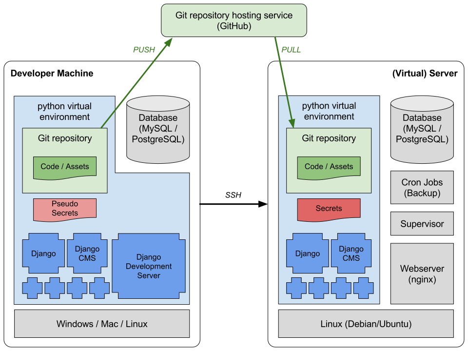

# Server setup, configuration and maintenance

The setup instructions are divided into:

* common steps for all setups

* steps for local development

* steps only necessary on the production server

The following picture sketches the setup. Some notes:

* Deployment is done by logging in to the server via SSH and pulling the (production-)branch from the repository

* The python virtual environment is configured the same locally and on the server.

* On the server a faster and more secure web server (nginx) is used instead of the Django development server

* Some secrets (config file with login information, secret keys) are not synchronized via the repository. This secrets also differ from the one used on development machines.



## Common steps

First update your system:

```shell
sudo apt-get update
sudo apt-get upgrade
```

### Installation:

We use a standard `Ubuntu 14.04.3 LTS` on the server. On development machines, any operating system can be used in principle. The instructions here are compiled for a Debian/Ubuntu installation. Some of the commands might be different for different systems.

Install the following packages with `sudo apt-get install ...`. Package names can deviate depending on your Linux distribution.

Use all-in-one line code below for convenience.

```shell
python-virtualenv
python-pip
mysql-server
libmysqlclient-dev
python-dev
gcc
gcc-multilib
rabbitmq-server // Message Broker: used by asynchronous email system (celery)
libjpeg-dev // used by pillow for image handling
git
```	
	
All-in-one line:

```shell
sudo apt-get install python-virtualenv python-pip mysql-server libmysqlclient-dev python-dev gcc gcc-multilib rabbitmq-server libjpeg-dev git
```

maybe reinstall if already installed without libjpeg-dev

```shell
sudo pip install -I pillow
```

(it is correct that `pillow` is installed outside the python virtual environment)

### Git

Create a folder on your machine where you want to store the local copy of the repository. This could e.g. be in your home directory.

```shell
mkdir ~/Projects/<project home>
```

Now cd into the newly created folder

```shell
cd ~/Projects/<project home>
```
	
and execute the following commands to tell git that your local copy of the repository now lives in this folder.

```shell
git init
git remote add origin https://github.com/gitsimon/tq_website.git
git fetch
git checkout -t origin/master
```
	

## Local Development

*do not use in production*

### Docker Development environment

You can use [Docker](http://www.docker.com) to setup a development environment.

Simply run
	``docker-compose up``
in the `tq_website` directory. It will fetch all required dependencies (except `settings_local.py` and the database) and start the development server on port 8000.

### Setup MySQL

Create MySQL-user `root` or `tq` and schema `tq_website` with a password you select. This can easily be done using MySQL-Workbench. Don't forget to grant all privileges to the user for our table.

TODO: Collation/Charset

### Editor

Install a local IDE. We highly recommend to use [PyCharm](https://www.jetbrains.com/pycharm/). The full version has Django support and is free for educational purposes.

To get the educational version, go to [PyCharm Student](https://www.jetbrains.com/shop/eform/students) and fill out the form using an official @ethz.ch mail address. After completing, you will receive an e-mail from JetBrains with a link to confirm your request. If all works well, you will receive another e-mail with further instructions on how to set up a JetBrains user account.

Finally you can download PyCharm Professional Edition, extract it and place it somewhere you want. There is no installation required. To start the program run `<YourPyCharmFolder>/bin/pycharm.sh`.

Activation is easiest if you download the licence-file from your JetBrains account-page. When asked for activation, simply drag&drop the file into the activation-key textbox.

### Virtual environment

From within your local development folder `<project home>/`, run

```shell
virtualenv env
```
	
This creates a virtual environment for you python packages, such that they do not interfere with you global python installation. It also helps to simulate the environment on the server as close as possible. Whenever you want to work on the project, first enter the virtual environment (do this in *each* terminal you want to execute project related commands) using 

```shell
source env/bin/activate
```
    
Now we have to install all required packages, since the virtual environment cannot itself be distributed with git. A file named `requirements.txt` lists all required packages. First get the newest files by running from within the local development folder `<project home>/`

```shell
git pull
```
	
Then enter the virtualenv as described above (you can see that you are inside the virtualenv if there is `(env)` prepended to the command prompt) and run

```shell
pip install -r requirements.txt
```

This will automatically download and install all required packages.

The next step *would* be running migrate, but currently this doesn't work. Therefore you have to download a database-backup from the server and apply it locally, using 

```shell
scp remoteuser@tqserver:/path/file /localpath/localfile
```
	
The downloaded backup can then be applied to the database by either the mysql workbench or with

```shell
mysql -u root -p tq_website < backupfile
```
	
Get in touch with admin for further details.


### Initial Configuration

Create the *secret* config file in the folder `<project home>/tq_website/settings_local.py`.
This file is not under version control because it contains some secrets.
Add something along these lines, replace all stars `****` with appropriate secrets:

```python
# SECURITY WARNING: keep the secret key used in production secret!
SECRET_KEY = '****'

# SECURITY WARNING: don't run with debug turned on in production!
DEBUG = True

# Configure the email host to send mails from
EMAIL_HOST = 'mailsrv.vseth.ethz.ch'
EMAIL_HOST_USER = 'informatik@tq.vseth.ch'
EMAIL_PORT = 587
EMAIL_USE_TLS = True
EMAIL_HOST_PASSWORD = '****'
DEFAULT_FROM_EMAIL = 'informatik@tq.vseth.ch'

# Database
DATABASES = {
    'default': {
        'ENGINE': 'django.db.backends.mysql',
        'HOST': 'localhost',
        'NAME': 'tq_website',
        'USER': 'root',
        'PASSWORD': '****',
    }
}
```
    
*Attention*: The configured mail account is used to - depending on the action - send huge amounts of auto-generated mails. Configure a test mail server before starting the `celery` task that sends out mails.

Run message passing server RabbitMQ (once started, it runs in background)

```shell
sudo rabbitmq-server
```
	
### Run website locally
	
Run local test server (*from within virtualenv*):

```shell
python manage.py runserver
```

Run celery if you want to send out mails (*from within virtualenv*):

```shell
python manage.py celeryd
```
	
At this point setup is finished and you should be able to view the local website at `127.0.0.1:8000`. Congratulations! Below are some commands that are used to keep your local installation up to date with the server.

--------------------------------------------------------------------------------------------------------------
	
There are some helpful *fabric* commands for handling the local test database. **They possibly destroy data**.
See `fabfile.py`. Use the commands defined there with e.g.

```shell
python manage.py recreate_database
python manage.py fill
```
    
    
### Apply code changes
Pull the changes from the correct branch (here the master):

```shell
git pull
```
    
Switch into virtualenv:

```shell
source env/bin/activate
```
    
If changes to installed python packages were made:

```shell
pip install -r requirements.txt
```
    
More clean, if there are already packages installed, remove them first.
NOTE: this is better then deleting and recreating the virtualenv because it preserves other virtualenv configurations.

```shell
pip freeze | xargs pip uninstall -y
```


Apply migrations

```shell
python manage.py migrate
```
    
Sometimes we have to separately migrate some apps previously not versioned, such as ckeditor.
After this they should be migrated in the future with the migrate command above.

```shell
manage.py migrate djangocms_text_ckeditor
```


## Instructions for server setup (in production)

Note: *In production* the setting is a bit different:

* a dedicated application server called gunicorn is used instead of the Django development server and run via supervisor

* as a webserver nginx is used

* celery is also run via supervisor

Setup is made along this instructions: [nginx, supervisor, gunicorn](http://michal.karzynski.pl/blog/2013/06/09/django-nginx-gunicorn-virtualenv-supervisor/)
(Note that we use MySQL instead of Postgres)

### Create user

Create user `django` with home `/webapps/`.

### virtualenv

From within `/webapps/tq_website` as user `django` run

```shell
create virtualenv env
```

### Configure supervisor
Create a config file in `/etc/supervisor/conf.d/`, e.g. `tq_website.conf` with the following content:
    
```
[program:tq_website]
command = /webapps/tq_website/bin/gunicorn_start                      ; Command to start app
user = django                                                         ; User to run as
stdout_logfile = /webapps/tq_website/logs/gunicorn_supervisor.log     ; Where to write log messages
redirect_stderr = true                                                ; Save stderr in the same log
environment=LANG=en_US.UTF-8,LC_ALL=en_US.UTF-8                       ; Set UTF-8 as default encoding

[program:tq_celery]
command = /webapps/tq_website/env/bin/python /webapps/tq_website/manage.py celeryd
directory = /webapps/tq_website/
user = django                                                         ; User to run as
stdout_logfile = /webapps/tq_website/logs/gunicorn_supervisor.log     ; Where to write log messages
redirect_stderr = true                                                ; Save stderr in the same log
environment=LANG=en_US.UTF-8,LC_ALL=en_US.UTF-8                       ; Set UTF-8 as default encoding

[program:tq_celerybeat]
command = /webapps/tq_website/env/bin/python /webapps/tq_website/manage.py celerybeat
directory = /webapps/tq_website/
user = django                                                         ; User to run as
stdout_logfile = /webapps/tq_website/logs/gunicorn_supervisor.log     ; Where to write log messages
redirect_stderr = true                                                ; Save stderr in the same log
environment=LANG=en_US.UTF-8,LC_ALL=en_US.UTF-8                       ; Set UTF-8 as default encoding
```

Double check that this config file is actually included from `/etc/supervisor/supervisord.conf`.

Start supervisor (is automatically done in daemon process):

```shell
sudo supervisord
```

Reload supervisor config files (this is **not** done automatically):

```shell
sudo supervisorctl reread
```
    
Start supervisor:

```shell
sudo service supervisor start
```
    
Start nginx:

```shell
sudo service nginx start
```


### Apply code changes
Change to the `django` user (sets working directory to `/webapps/tq_website/`:

```shell
su - django
```
    
Pull the changes from the correct branch (here the master):

```shell
git pull
```
    
Switch into virtualenv:

```shell
source env/bin/activate
```
    
If changes to installed python packages were made:

```shell
pip install -r requirements.txt
```
    
More clean, if there are already packages installed, remove them first.
NOTE: this is better then deleting and recreating the virtualenv because it preserves other virtualenv configurations.

```shell
pip freeze | xargs pip uninstall -y
```


Apply migrations

```shell
python manage.py migrate
```
    
Sometimes we have to separately migrate some apps previously not versioned, such as ckeditor.
After this they should be migrated in the future with the migrate command above.

```shell
manage.py migrate djangocms_text_ckeditor
```
    
Change back to normal user

```shell
logout
```

Restart supervisor and nginx (*in this order*):

```shell
sudo service supervisor restart
sudo service nginx restart
```
    
The first line is a shorthand for starting individual processes:

```shell
sudo supervisorctl restart tq_website
sudo supervisorctl restart tq_celery
sudo supervisorctl restart tq_celerybeat
```

*Note* that this only restarts managed applications and does not reread configuration changes of supervisor. After configuration changes run 

```shell
sudo service supervisor stop
sudo service supervisor start
```
 

### Update server:

```shell
sudo apt-get update
sudo apt-get upgrade
```

Old linux images are not automatically removed, regularly check free space in /boot/

```shell
df -h
```

Check wich kernel is currently used

```shell
uname -r
```

remove other kernels found in `/boot/` with

```shell
sudo apt-get autoremove linux-...
```
   
or automatically remove old kernels with this helper program from [Random tools](http://packages.ubuntu.com/de/precise/misc/bikeshed)

```shell
sudo apt-get install bikeshed
sudo purge-old-kernels
```

Don't forget to restart supervisor after updates

```shell
sudo service supervisor stop
sudo service supervisor start
```
