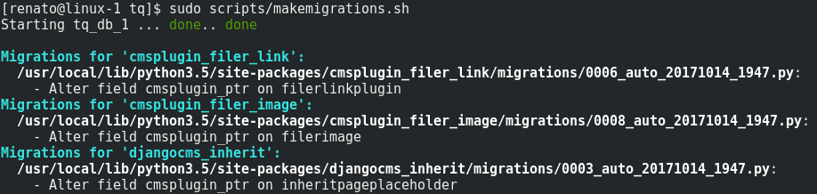
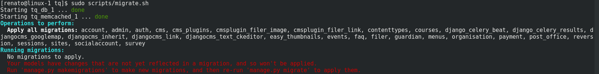

Solving migration errors
========================

The steps described in this article were developed for `this commit <https://github.com/tanzquotient/tq_website/commit/238c0fbb66560df996e5186fef9a141d769c726c>`_.
It took a long time to arrive at this solution. So now that you're here: it's not because you're stupid!

Scenario:
---------

You try to migrate using our :code:`scripts/makemigrations.sh` and :code:`scripts/migrate.sh` scripts.
When you run :code:`makemigrations.sh`, everything is fine and you get a list of (external) apps for which updates exist:

But when you run :code:`migrate.sh`, you get the following error message:

Solution:
---------
- Locate the Python packages corresponding to the Django apps that are listed by :code:`makemigrations.sh`.
- Find the entries (and therefore the versions) of the packages in our :code:`configurations/python-requirements`. In the images above, the affected packages are :code:`cmsplugin-filer`, :code:`django-filer` (not sure if both are needed.\.\. if in doubt, just upgrade all candidates) :code:`djangocms-googlemap`, :code:`djangocms-inherit` and :code:`djangocms-link`.
- Search for the packages on `PyPI <https://pypi.python.org/pypi>`_ and get the newest version.
- Update :code:`python-requirements.txt` to the new values.

  **Always use == to indicate versions, never use >= !**
  
  Reason: Package upgrades might break our images. So if external package A is updated and the new version would break our build, we don't notice this. But when somebody tries to build our docker image at some point in the future, the build fails, although it has always worked before! Then it's difficult to find the correct package version that were in use at the time when the dependency was added/updated.
- Rebuild the image; the following code should be run in the parent directory that contains all code:
  
  .. code-block:: bash
  
    docker-compose build

- Actually perform the migrations:

  .. code-block:: bash

    scripts/makemigrations.sh
    scripts/migrate.sh

- Don't forget to :ref:`update the table of our dependencies <python_packages>`!
