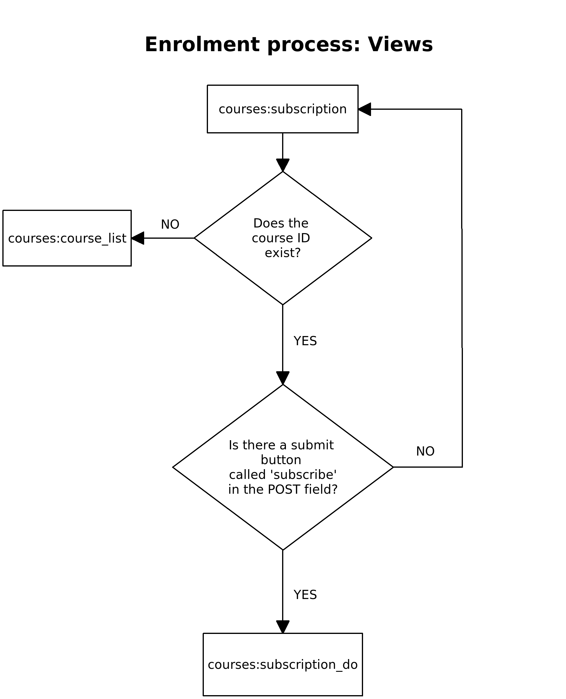

Enrolment in a course
=====================

Enrolment in a course is not a difficult process. But since it is one of the core functionalities of this project, there needs to be documentation.

High level procedure
--------------------
The following flowchart gives an overview of the involved views and how they interact with each other:

Which files are involved?
-------------------------

- :code:`courses/views.py`: The views that handle the enrolment and present success/failure to the user
- :code:`courses/services.py`: The function :code:`subscribe` is responsible for the actual enrolment
