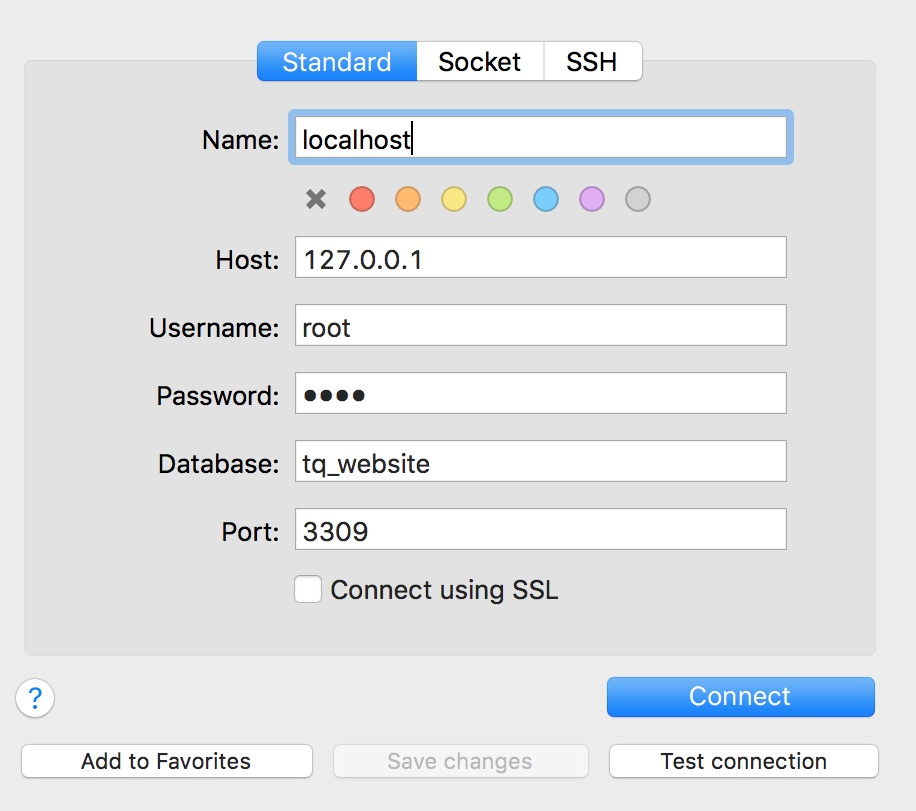

===========================================
Server setup, configuration and maintenance
===========================================

Introduction and general architecture
-------------------------------------
This file contains setup with docker. Many of the steps you may expect to setup a webstack are automatized. You can still look them up in the `Dockerfile <https://github.com/tanzquotient/tq_website/blob/master/configurations/dockerfile-new>`_.

The setup instructions are divided into:

- common steps for all setups
- steps for local development
- steps only necessary on the production server

The following picture sketches the setup. Some notes:

- Deployment is done by logging in to the server via SSH and pulling the (production-)branch from the repository
- The python environment is configured the same locally and on the server.
- On the server a faster and more secure web server (nginx) is used instead of the Django development server
- Some secrets (config file with login information, secret keys) are not synchronized via the repository. This secrets also differ from the one used on development machines.

.. image:: ../../dev/webstack.svg
  :alt: Webstack

Setup basic tools
-----------------

You must use `git <https://git-scm.com/>`_ for code management and `Docker <https://www.docker.com/>`_ for setup automation.

We use a standard `Debian 8` on the server. On development machines, any operating system can be used in principle (we know that many Linux und Mac OS versions works). The instructions here are compiled for a **Debian/Ubuntu** installation.

First update your system:

.. code-block:: bash

  sudo apt-get update
  sudo apt-get upgrade

*NOTE*: Package names can deviate depending on your Linux distribution.

.. code-block:: bash

    sudo apt-get install git mysql-client

We need `Docker Community Edition (CE) <https://docs.docker.com/engine/installation/linux/ubuntu/>`_ and `docker-compose <https://docs.docker.com/compose/install/>`_. With prerequisites satisfied, it boils down to

.. code-block:: bash

    sudo apt-get install docker-ce
    sudo curl -L "https://github.com/docker/compose/releases/download/1.11.2/docker-compose-$(uname -s)-$(uname -m)" -o /usr/local/bin/docker-compose
    sudo chmod +x /usr/local/bin/docker-compose

Start the docker daemon:

.. code-block:: bash

    sudo service docker start

Setup basic tools with Fedora
~~~~~~~~~~~~~~~~~~~~~~~~~~~~~
The above instructions are basically the same with Fedora, except that you have have to use dnf instead of apt. Altogether, the following instructions install everything one needs:

.. code-block:: bash

    sudo dnf update
    sudo dnf install git mysql docker docker-compose

IDE
~~~

Install a local IDE. We highly recommend to use `PyCharm <https://www.jetbrains.com/pycharm/>`_. The full version has Django support and is free for educational purposes.

To get the educational version, go to `PyCharm Student <https://www.jetbrains.com/shop/eform/students>`_ and fill out the form using an official @ethz.ch mail address. After completing, you will receive an e-mail from JetBrains with a link to confirm your request. If all works well, you will receive another e-mail with further instructions on how to set up a JetBrains user account.

Finally you can download PyCharm Professional Edition, extract it and place it somewhere you want. There is no installation required. To start the program run :code:`<YourPyCharmFolder>/bin/pycharm.sh`.

Activation is easiest if you download the licence-file from your JetBrains account-page. When asked for activation, simply drag&drop the file into the activation-key textbox.

Setup local project folder
--------------------------

Pull files with git
~~~~~~~~~~~~~~~~~~~

Create a folder on your machine where you want to store the local copy of the repository. This could e.g. be in your home directory.

.. code-block:: bash

    mkdir ~/Projects/<project home>

Now cd into the newly created folder

.. code-block:: bash

    cd ~/Projects/<project home>

and execute the following commands to tell git that your local copy of the repository now lives in this folder.

.. code-block:: bash

    git init
    git remote add origin https://github.com/gitsimon/tq_website.git
    git fetch
    git checkout -t origin/master

If you want to work on your own branch, create it and check it out

.. code-block:: bash

    git branch dev-<your name>
    git checkout dev-<your name>

You can push it to the server and setup push/pull by

.. code-block:: bash

    git push -u origin <branch>

It's a good idea to rebase your branch on the master from time to time. While your branch is checked out, run:

.. code-block:: bash

    git rebase master

Git is a powerful tool. Have a look at the `official documentation <https://git-scm.com/doc>`_, especially on `branching <https://git-scm.com/book/it/v2/Git-Branching-Remote-Branches>`_.

Make helper scripts executable
~~~~~~~~~~~~~~~~~~~~~~~~~~~~~~

Since file permissions are not synchronized with git, you have to make the helper scripts executable:

.. code-block:: bash

    sudo chmod +x scripts/*

Initial Configuration
~~~~~~~~~~~~~~~~~~~~~

We have to create 2 files, that are not under version control, manually:

Create the maintenance file :code:`<project home>/maintenance.conf`. You can use the provided template file and copy it with

.. code-block:: bash

    cp configurations/maintenance-template.conf maintenance.conf

(Whenever doing maintenance on a live server, switch the flag in this file to 1 (and back again), and restart docker-compose to make nginx reload the config and display a maintenance message)

Create the *secret* environment file :code:`<project home>/.env`. You can use the provided template file and copy it with

.. code-block:: bash

    cp configurations/.env-template .env

This files are not under version control because it contains some secrets and machine dependent configurations and secrets.

*Attention*: The configured mail account is used to - depending on the action - send huge amounts of auto-generated mails. Leave the mail settings empty (as it is in the template) or configure a test mail server before starting a production-like docker configuration (which will actually send out mails!).

Let docker install all development dependencies
-----------------------------------------------

*Note:* In the current setup the :code:`docker-compose.yml` is customized via environment variables. Due to escaping issues, this works only with the zsh shell which may not be standard on some unix based systems.

**On development machine**:

Run in the :code:`<project home>` directory:

.. code-block:: bash

    docker-compose build

It will fetch all required dependencies and install it for you.

*Note*: This can take some minutes

*Note*: If you encounter a problem because some ports are already in use, you can choose your preferred development ports in the :code:`.env`-file.

**In production environment** (or to setup a production-like stack on development machine):

.. code-block:: bash

    docker-compose -f docker-compose-production.yml build

**Simulated production environment** (to setup a production-like stack on development machine):

.. code-block:: bash

    docker-compose -f docker-compose-production-no_ssl.yml build

Load test data into database
----------------------------

Get in touch with admin to get a backup of live database (with removed personal data).
The backup can then be applied to the database with (while docker is running the containers)

.. code-block:: bash

    mysql -h 127.0.0.1 --port=3309 -u root -proot -t tq_website < database_dump.sql

    
Create super user
-----------------

Create a superuser with your favorite name and password:

.. code-block:: bash

    ./scripts/create_superuser.sh

*Note*: This are the credentials to login anywhere on the frontend/backend.

*Note*: Even if the loaded database dump contains a user representing you you have to repeat that step since the dump has different salted passwords, so your password will be considered invalid.

Test the website locally
------------------------

Whenever working on the project, run the following command in the :code:`<project home>` directory primarily:

.. code-block:: bash

    docker-compose up --build

While this command is running you should be able to view the local, full-stack website at this addresses:

- :code:`localhost:8000` or :code:`127.0.0.1:8000`
- :code:`localhost:8001` or :code:`127.0.0.1:8001` (if you started with :code:`-f docker-compose-production-no_ssl.yml`)

Setup on a Mac
--------------

If you have a Mac and prefer to use GUIs, the following tutorial gives an alternative way over the command line setup:

Download the necessary Software:
~~~~~~~~~~~~~~~~~~~~~~~~~~~~~~~~

- `Docker for Mac <https://store.docker.com/editions/community/docker-ce-desktop-mac>`_

- `Download PyCharm <https://www.jetbrains.com/pycharm/download/#section=mac>`_ - As a student, you can get a professional license for free

- `Sequel Pro <https://sequelpro.com/download#auto-start>`_

Debugger
~~~~~~~~

#. Open the pycharm settings
#. In the *Settings / Preferences* dialog go to *Build, Execution, Deployment* and then *Docker*
#. Click on *+* and then *Apply*
#. Go to *Project: tq_website*, then *Project Interpreter* and in the *Drop Down Menu* choose *Show All*
#. Click on the *+* and then *Add Remote*
#. In the Pop-Up, choose *Docker-Compose*

    a) Under *Server*, *Docker* should show up (only if you did steps 2. and 3. right)
    b) *Configuration Files* should show your docker-compose.yml file (if not, are you in the tq_website project?)
    c) *Service* should have *Django*

#. Apply and close, go back to the main editor. In the right upper corner click on the combo box reading *tq_website*, and then *Edit Configurations*
#. In the pop-up, with the tq_website configuration selected, choose *Host* to be *0.0.0.0*

Sequel Pro
~~~~~~~~~~

Password: root

PyCharm
~~~~~~~
#. On the main menu, choose File | Open.
#. Select the directory that contains the desired source code (pulled from git repository).
#. Click ok.
